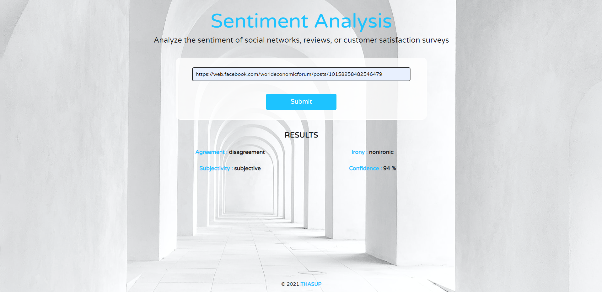

<!-- Add banner here -->

# Sentiment Analysis App

<!-- Describe your project in brief -->

Single page application that allows users to run Natural Language Processing (NLP) on articles or blogs found on other websites.

Sentiment Analysis App [Link](https://thasup-sentiment-analysis.netlify.app/)

# Table of contents

- [Sentiment-Analysis-App](#sentiment-analysis-app)
- [Table of contents](#table-of-contents)
- [Languages](#languages)
- [Install](#install)
- [How to get your API key](#how-to-get-your-api-key)
- [Dependencies](#dependencies)
- [Technology](#technology)

# Languages

[(Back to top)](#table-of-contents)

- HTML
- SCSS
- JavaScript

# Install

[(Back to top)](#table-of-contents)

1. clone this git on computer
2. install node.js
3. run command `npm install` on terminal
4. acquire your API key and replace it in `meaningCloudAPI` variable at `My-Evaluate-News-NLP\src\server\index.js`
5. run command `npm run build-prod` on terminal
6. run command `npm run start` on terminal
7. go to `http://localhost:8081/`
8. happy!

# How to get your API key

[(Back to top)](#table-of-contents)

You can find the API [here](https://www.meaningcloud.com/developer/sentiment-analysis). Once you create an account with MeaningCloud, you will be given a license key to start using the API.

# Dependencies

[(Back to top)](#table-of-contents)

- cors version 2.8.5
- dotenv version 10.0.0
- express version 4.17.1
- node-fetch version 3.1.0
- webpack version 5.63.0
- webpack-cli version 4.9.1

# Technology

[(Back to top)](#table-of-contents)

- HTML
- SCSS
- Javascript
- Bootstrap
- DOM
- Node.js
- Express.js
- API
- Webpack
- Service Worker
- Netlify
- Docker
